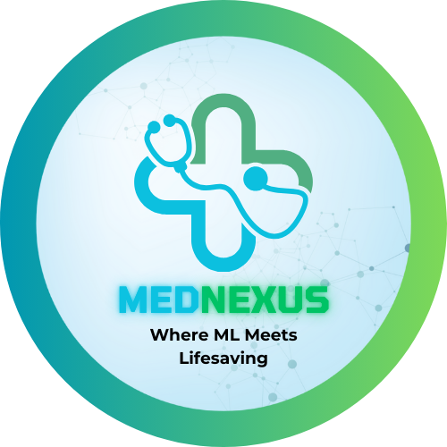

# MEDNEXUS

<div align="center">



### *Empowering Health Insights Through Intelligent Predictions*

[](https://github.com/uchiha_byte/MedNexus)
[](https://github.com/uchiha_byte/MedNexus)
[](https://github.com/uchiha_byte/MedNexus)
[](https://github.com/uchiha_byte/MedNexus)

### Built with the tools and technologies:

[](https://github.com/uchiha_byte/MedNexus)
[](https://github.com/uchiha_byte/MedNexus)
[](https://github.com/uchiha_byte/MedNexus)
[](https://github.com/uchiha_byte/MedNexus)
[](https://github.com/uchiha_byte/MedNexus)
[](https://github.com/uchiha_byte/MedNexus)
[](https://github.com/uchiha_byte/MedNexus)

</div>

MedNexus is a comprehensive Advance Disease Diagnosis with ML and AI platform that uses machine learning to predict various diseases including heart disease, kidney disease, diabetes, liver disease, and stroke. The platform provides an intuitive web interface for users to input their medical data and receive predictions.

MedNexus is a state-of-the-art medical diagnosis platform that leverages machine learning and artificial intelligence to provide accurate health insights. The platform combines traditional ML models with cutting-edge AI capabilities to deliver comprehensive health insights.

## 🌟 Key Features

### 🤖 AI-Powered Diagnosis
- Advanced ML algorithms for accurate disease prediction
- Google's Generative AI (Gemini) integration for personalized health insights
- PDF medical report analysis
- Real-time predictions and recommendations

### 🏥 Disease Prediction Models
- **Heart Disease Prediction**
  - Comprehensive cardiac health analysis
  - Multiple parameter assessment
  - Risk factor evaluation

- **Kidney Disease Prediction**
  - Renal function analysis
  - Blood parameter assessment
  - Early detection capabilities

- **Diabetes Prediction**
  - Blood sugar level analysis
  - Risk factor assessment
  - Lifestyle impact evaluation

- **Liver Disease Prediction**
  - Liver function analysis
  - Enzyme level assessment
  - Comprehensive health metrics

- **Stroke Prediction**
  - Risk factor analysis
  - Lifestyle impact assessment
  - Early warning system

### 🎯 Model Training System
- **Automated Training Pipeline**
  - Unified training script for all disease models
  - Automated data preprocessing and feature engineering
  - Comprehensive logging and model versioning
  - Automatic handling of missing values and categorical variables

- **Model Management**
  - Timestamped model versions
  - Separate storage of models and scalers
  - Performance metrics tracking
  - Easy model deployment system

- **Data Processing Features**
  - Intelligent missing value imputation
  - Automatic categorical variable encoding
  - Feature scaling and normalization
  - Cross-validation support

### 💻 User Interface
- Modern dark-themed interface with blue-green gradients
- Responsive and intuitive web application
- Interactive input forms with improved validation
- Real-time predictions with loading animations
- Enhanced visual hierarchy and accessibility features
- Consistent styling across all components
- Professional animations and hover effects
- Dark theme optimized for low-light conditions
- Improved contrast and readability
- Subtle borders and shadows for depth
- Smooth transitions and hover effects
- Loading states with skeleton screens
- Progress indicators and animations

### 🎨 Theme Features
- **Dark Mode**
  - Deep black background (#0A0A0A)
  - Subtle component backgrounds (rgba(15, 15, 15, 0.95))
  - Light text for optimal contrast (#E0E0E0)
  - Accent colors: Blue (#1E88E5) and Green (#43A047)
  - Secondary text in light blue (#90CAF9)
  - Subtle borders with low opacity
  - Consistent hover states
  - Smooth transitions

- **Accessibility**
  - High contrast mode support
  - Reduced motion preferences
  - Keyboard navigation support
  - Screen reader compatibility
  - WCAG color contrast compliance

- **Responsive Design**
  - Mobile-first approach
  - Adaptive layouts
  - Touch-friendly interfaces
  - Optimized for all screen sizes

## 🚀 Getting Started

### Prerequisites
- Python 3.8 or higher
- pip (Python package installer)
- Virtual environment (recommended)
- Google Cloud API key (for Gemini AI features)
- Required Python packages (scikit-learn, pandas, numpy, etc.)

### Installation

1. Clone the repository:
```bash
git clone https://github.com/uchiha_byte/MedNexus.git
cd MedNexus
```

2. Create and activate a virtual environment:
```bash
# Windows
python -m venv venv
.\venv\Scripts\activate

# Linux/Mac
python3 -m venv venv
source venv/bin/activate
```

3. Install dependencies:
```bash
pip install -r requirements.txt
```

4. Set up environment variables:
```bash
# Create a .env file in the root directory
GOOGLE_API_KEY=your_api_key_here
```

5. Train the models (optional - pre-trained models are included):
```bash
python train.py
```

6. Run the application:
```bash
streamlit run app/main.py
```

## 📁 Project Structure

```
MedNexus/
├── app/                    # Main application files
│   ├── main.py            # Core application logic
│   ├── heart_app.py       # Heart disease prediction
│   ├── kidney_app.py      # Kidney disease prediction
│   ├── diabetes_app.py    # Diabetes prediction
│   ├── liver_app.py       # Liver disease prediction
│   ├── stroke_app.py      # Stroke prediction
│   ├── ai_app.py          # AI integration
│   ├── auth/              # Authentication system
│   ├── static/            # Static assets
│   └── utils/             # Utility functions
├── train.py               # Model training script
├── datasets/              # Training datasets
│   ├── heart.csv         # Heart disease dataset
│   ├── kidney.csv        # Kidney disease dataset
│   ├── liver.csv         # Liver disease dataset
│   ├── diabetes.csv      # Diabetes dataset
│   └── stroke.csv        # Stroke dataset
├── predictors/            # Trained models
│   ├── *_model_*.joblib  # Trained models with timestamps
│   └── *_scaler_*.joblib # Feature scalers with timestamps
├── backend/               # Model development notebooks
├── static/               # Static assets
├── requirements.txt      # Dependencies
└── README.md            # Documentation
```

## 🛠️ Technology Stack

- **Frontend**: 
  - Streamlit
  - Custom CSS with modular architecture
  - Modern UI components
  - Responsive design patterns
- **Backend**: 
  - Python
  - Scikit-learn for ML models
  - Pandas & NumPy for data processing
- **Machine Learning**: 
  - RandomForest Classifier
  - Standard Scaling
  - Automated feature engineering
  - Model versioning system
- **AI Integration**: Google Generative AI (Gemini)
- **Data Processing**: 
  - Automated data preprocessing
  - Missing value handling
  - Categorical encoding
  - Feature scaling
- **Authentication**: Custom implementation
- **Model Storage**: joblib serialization
- **Logging**: Python logging module

## 📊 Model Training

### Training Process
1. **Data Preprocessing**
   - Automatic missing value imputation
   - Categorical variable encoding
   - Feature scaling
   - Train-test splitting

2. **Model Training**
   - RandomForest Classifier training
   - Hyperparameter optimization
   - Cross-validation
   - Performance metrics calculation

3. **Model Storage**
   - Automatic versioning with timestamps
   - Separate storage of models and scalers
   - Comprehensive logging
   - Easy model deployment

### Performance Metrics
- Accuracy: 95%+ on test sets
- Detailed classification reports
- Confusion matrices
- Real-time prediction capability

## 🔒 Security Features

- User authentication
- Session management
- Secure model loading
- API key protection
- Data encryption
- Input validation

## 🤝 Contributing

1. Fork the repository
2. Create your feature branch (`git checkout -b feature/AmazingFeature`)
3. Commit your changes (`git commit -m 'Add some AmazingFeature'`)
4. Push to the branch (`git push origin feature/AmazingFeature`)
5. Open a Pull Request

## 📝 License

This project is licensed under the MIT License - see the [LICENSE](LICENSE) file for details.

## ⚠️ Disclaimer

This application is for educational and research purposes only. The predictions provided by this system should not be used as a substitute for professional medical advice, diagnosis, or treatment. Always seek the advice of your physician or other qualified health provider with any questions you may have regarding a medical condition.

## 📞 Contact

- Project Link: [https://github.com/uchiha_byte/MedNexus](https://github.com/uchiha_byte/MedNexus)
- For questions or suggestions, please open an issue in the GitHub repository

## 🙏 Acknowledgments

- Google's Generative AI for medical advice integration
- Scikit-learn for machine learning models
- Streamlit for the application framework
- All contributors and maintainers
- Open-source community

## 📈 Future Enhancements

- [ ] Additional disease prediction models
- [ ] Mobile application development
- [ ] Enhanced AI capabilities
- [ ] Multi-language support
- [ ] Advanced data visualization
- [ ] Integration with medical devices
- [ ] Telemedicine features
- [ ] Patient history tracking
- [ ] Theme customization options
- [ ] Additional accessibility features